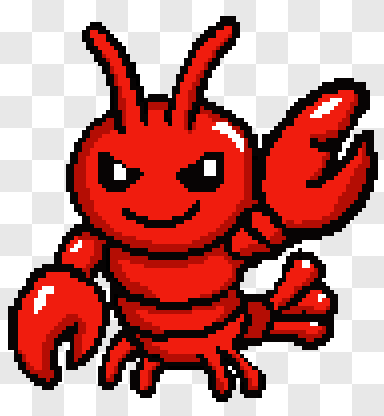
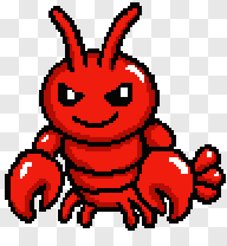
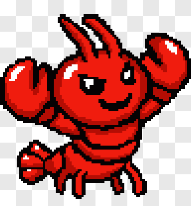
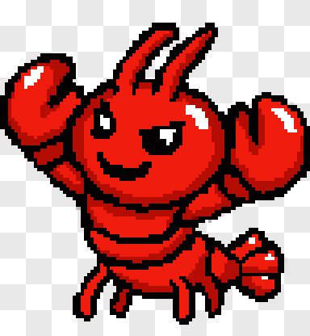
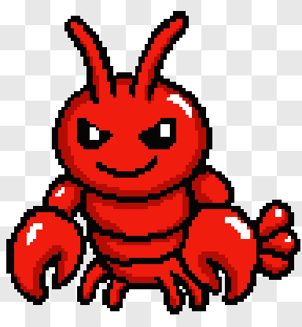
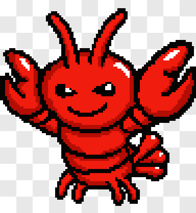
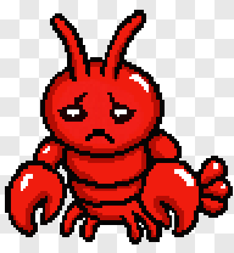

<div align="center">

# Openclaw Codex Pet


An (unofficial) OpenClaw lobster pet for your Codex App. This is a v1, but he's Codex-generated, and hand animated. I'm going to hopefully take another pass at some of the animations that didn't turn out as well at some point.

</div>

## Preview

<table>
<tr><th>Action</th><th>Preview</th></tr>
<tr><td><strong>Idle</strong></td><td></td></tr>
<tr><td><strong>Waving</strong></td><td></td></tr>
<tr><td><strong>Running</strong></td><td></td></tr>
<tr><td><strong>Running Right</strong></td><td></td></tr>
<tr><td><strong>Running Left</strong></td><td></td></tr>
<tr><td><strong>Waiting</strong></td><td></td></tr>
<tr><td><strong>Jumping</strong></td><td></td></tr>
<tr><td><strong>Failed</strong></td><td></td></tr>
<tr><td><strong>Review</strong></td><td></td></tr>
</table>

## Install

Clone or download this repo, then copy the pet package into your Codex pets directory:

```sh
mkdir -p ~/.codex/pets
mkdir -p ~/.codex/pets/openclaw
cp pet.json spritesheet.webp ~/.codex/pets/openclaw/
```

Restart Codex, then choose `Openclaw` from the pet picker.

## Package

```text
.
├── pet.json
└── spritesheet.webp
```

Preview assets live outside the pet package:

```text
assets/previews/
├── contact-sheet.png
└── gifs/
```

## Validate

```sh
npm run validate
```

## License

Openclaw Codex Pet is licensed under `MIT OR Apache-2.0`.

That applies to the pet assets, generated previews, metadata, scripts, and docs.
Use whichever license best fits your downstream project.

Full texts:

- [MIT](./LICENSE-MIT)
- [Apache-2.0](./LICENSE-APACHE)
